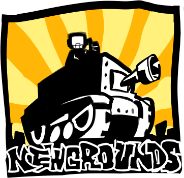

# ovo-unblocked-sl4ckrr.github.io
description: OvO is a fast paced parkour platformer. It started as a fun game jam entry, but it is now a popular speedrun game with a very active community.
created by Ossama 'skymen' Jouini :)

# visit the site of sites

https://sl4ckrr.github.io./TSOS

# more games here:
- the sl4ckrr game library
  https://sl4ckrr.github.io./projects.html
    https://sl4ckrr.github.io./ovo
  

  

full of games and even our jsemulator:
just drop the file into the project and it will load the gba,gbc,gb wtv idc
  https://sl4ckrr.github.io./jsemulator

# - sl4ckrr

